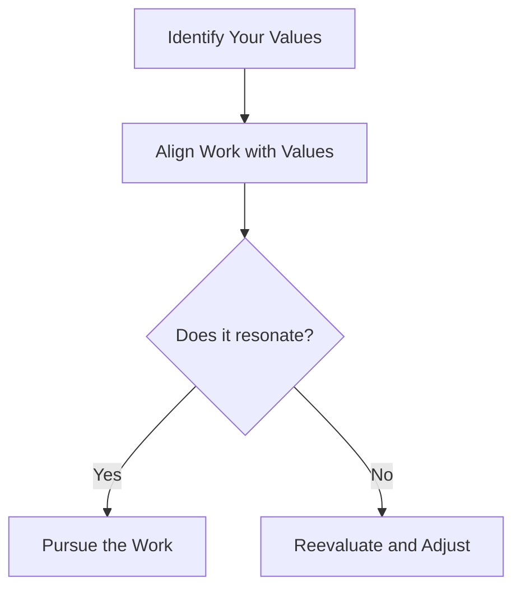

import { Callout, Steps, Step } from "nextra-theme-docs";

# Embracing Your Calling

As an artist or entrepreneur, it's essential to recognize and pursue your authentic path. This means understanding your unique gifts, passions, and the value you bring to the world. When you embrace your calling, you tap into a deep well of motivation and creativity that fuels your work and helps you overcome challenges.

## Identifying Your Unique Gifts

- Take time to reflect on your natural talents and the activities that bring you joy and fulfillment.
- Consider the skills and abilities that come easily to you, and explore how they can be applied to your creative or entrepreneurial pursuits.
- Seek feedback from trusted friends, family, or mentors who can offer insights into your strengths and potential.

<Callout type="info">
Remember, your unique gifts are not just about what you're good at, but also what energizes and inspires you.
</Callout>

## Aligning Your Work with Your Values

- Clarify your core values and the principles that guide your life and work.
- Evaluate whether your current creative or entrepreneurial efforts align with these values.
- Make conscious choices to pursue projects and opportunities that resonate with your authentic self.

## Overcoming Self-Doubt and Fear

Embracing your calling often means confronting self-doubt and fear. These emotions are natural, but they can hold you back if left unchecked. To overcome them:

<Steps>

### Acknowledge your fears
Recognize that fear is a normal part of the creative process and that it doesn't have to control you.

### Reframe your perspective
View challenges as opportunities for growth and learning rather than threats to your success.

### Take action despite fear
Start small and build momentum gradually. Celebrate each step forward as a victory over self-doubt.

</Steps>

## Trusting the Journey

Embracing your calling is an ongoing process that requires trust and patience. There will be ups and downs along the way, but staying committed to your path will ultimately lead you to a more fulfilling and impactful life.

As author Steven Pressfield writes in *The War of Art*:

> "Our job in this lifetime is not to shape ourselves into some ideal we imagine we ought to be, but to find out who we already are and become it."

By embracing your calling, you honor your authentic self and contribute your unique gifts to the world. Stay true to your path, and trust that it will lead you exactly where you need to go.

For more insights on staying true to your creative voice, see the section on [The Territorial Perspective](/authentic-voice/territorial-perspective).