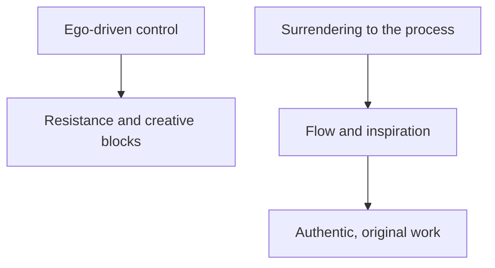

import { Callout, Steps, Step } from "nextra-theme-docs";

# Surrendering to the Creative Process

In the realm of creativity, the ego often tries to maintain control, believing that it knows best how to navigate the artistic journey. However, true breakthroughs and masterpieces emerge when we learn to surrender to the creative process, allowing it to unfold naturally without forceful direction.

## The Importance of Letting Go

Letting go of the need to control every aspect of your creative work can be challenging, but it is essential for tapping into the flow of inspiration. When you relinquish your grip on the outcome and trust the process, you open yourself up to possibilities that your conscious mind may have overlooked.

<Callout type="info">
Surrendering to the creative process doesn't mean abandoning structure or discipline. It simply means being open to unexpected insights and allowing your work to evolve organically.
</Callout>

## Strategies for Surrendering

Embracing the art of surrender requires practice and patience. Here are some strategies to help you let go and trust the creative process:

<Steps>
### Step 1: Cultivate a beginner's mind

Approach your work with a sense of curiosity and openness, as if you're exploring it for the first time. Let go of preconceived notions and be willing to discover new aspects of your craft.

### Step 2: Practice non-attachment

Detach yourself from the outcome and focus on the present moment. Embrace the journey of creation without fixating on the destination. Remember that the process itself is valuable, regardless of the final result.

### Step 3: Trust your intuition

Learn to listen to your inner voice and trust your instincts. When you find yourself at a crossroads, pause and tune into your intuition for guidance. Often, the most authentic creative choices come from a place of deep knowing rather than rational analysis.
</Steps>

## The Role of the Muse

In [The Role of the Muse](/higher-inspiration/role-of-muse), we explored the concept of invoking divine inspiration to aid the creative process. Surrendering to the creative flow goes hand in hand with inviting the Muse into your work. By relinquishing control and allowing the Muse to guide you, you open yourself up to insights and ideas that may have otherwise remained hidden.

## Overcoming Resistance

As you practice surrendering to the creative process, you may encounter [Resistance](/overcoming-resistance) in the form of fear, doubt, or the urge to control. Recognize these obstacles as natural parts of the journey and use the strategies outlined in [Strategies for Combating Resistance](/overcoming-resistance/strategies-combating-resistance) to overcome them.

Remember, surrendering to the creative process is an ongoing practice. It requires faith, patience, and a willingness to embrace the unknown. By letting go of the need to control every aspect of your work, you allow the magic of creativity to unfold in its own time and in its own way.

As the diagram illustrates, surrendering to the creative process ($C$) leads to a state of flow and inspiration ($D$), which ultimately results in authentic, original work ($E$). In contrast, attempting to maintain ego-driven control ($A$) often gives rise to Resistance and creative blocks ($B$).

By embracing the art of surrender, you align yourself with the natural flow of creativity and open the door to profound artistic expression.