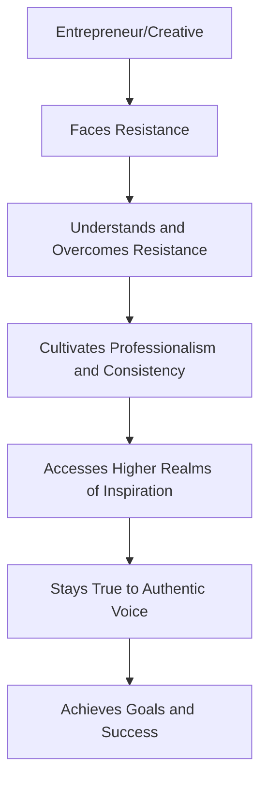

import { Callout, Steps, Step } from "nextra-theme-docs";

# Introduction

In the world of entrepreneurship and creative pursuits, we often face internal obstacles that can hinder our progress and prevent us from achieving our full potential. <Callout>These obstacles, collectively referred to as "Resistance" by author Steven Pressfield in his book "The War of Art," can take many forms, such as procrastination, self-doubt, and fear of failure.</Callout> However, by understanding the nature of Resistance and employing strategies to overcome it, we can unlock our creativity, increase productivity, and ultimately succeed in our endeavors.

Throughout this guide, we will explore the key themes and principles from "The War of Art" and learn how to apply them in practical ways. We'll cover topics such as:

- **[Understanding and Overcoming Resistance](/overcoming-resistance)**: Identify the various manifestations of Resistance and discover effective techniques to conquer them.
- **[Cultivating Professionalism and Consistency](/professionalism-consistency)**: Develop the habits and discipline necessary to consistently produce high-quality work.
- **[Accessing Higher Realms of Inspiration](/higher-inspiration)**: Connect with sources of inspiration beyond the rational mind to enhance creativity.
- **[Staying True to Your Authentic Voice](/authentic-voice)**: Express your unique creative voice without succumbing to comparison or seeking external validation.

By implementing these principles, entrepreneurs and creatives can develop a resilient mindset, establish a strong work ethic, and tap into a wellspring of inspiration. Whether you're launching a startup, writing a novel, or pursuing any other creative venture, the insights from "The War of Art" can help you overcome internal barriers and achieve your goals.

$Resistance \propto \frac{1}{Professionalism \times Inspiration \times Authenticity}$

As you progress through this guide, you'll gain a deeper understanding of the forces at play within the creative process and learn how to harness them for your own success. So, let's dive in and explore how to implement the principles from "The War of Art" to unleash your full creative potential.

