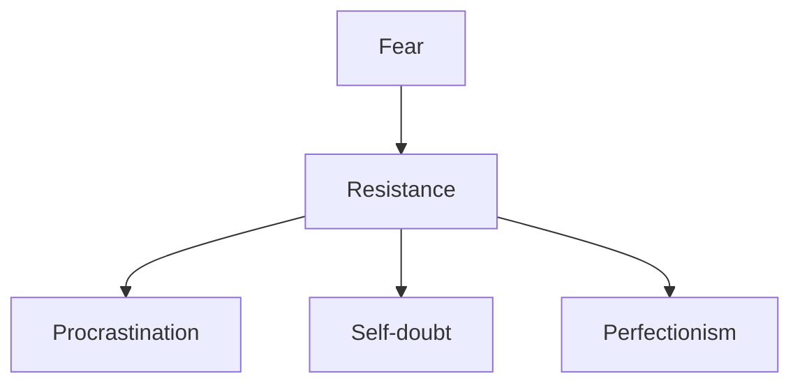

import { Callout, Steps, Step } from "nextra-theme-docs";

# Defining Resistance

Resistance is the invisible force that stands between you and your creative goals. It's the internal barrier that arises whenever you set out to pursue a calling or embark on an endeavor that matters deeply to you. Understanding the nature of Resistance is crucial for anyone seeking to overcome it and achieve their full potential.

## The Many Faces of Resistance

Resistance manifests in various forms, such as:

- Procrastination
- Self-doubt
- Fear of failure or success
- Perfectionism
- Distraction and escapism
- Rationalizing and making excuses

<Callout type="info">
Resistance is a universal phenomenon that affects everyone, not just artists and entrepreneurs. It's a natural part of the human experience, but it can be overcome with awareness and perseverance.
</Callout>

## The Characteristics of Resistance

To effectively combat Resistance, it's essential to recognize its key characteristics:

1. **Resistance is internal:** It comes from within, not from external obstacles or circumstances.
2. **Resistance is insidious:** It often disguises itself as rational thoughts or legitimate concerns.
3. **Resistance is persistent:** It never goes away entirely, but it can be managed and overcome.
4. **Resistance is universal:** Everyone faces Resistance in some form, regardless of their field or level of experience.

## The Relationship Between Fear and Resistance

At its core, Resistance is fueled by fear. It's the fear of the unknown, the fear of failure, and even the fear of success. When we set out to do something that matters to us, we become vulnerable to these fears, and Resistance seizes upon them to hold us back.

To overcome Resistance, we must learn to [cultivate professionalism and consistency](/professionalism-consistency) in our creative practice. By developing the habits and discipline of a professional, we can push through the fear and maintain forward momentum in the face of Resistance.

Additionally, [accessing higher realms of inspiration](/higher-inspiration) can help us transcend the limitations of our rational minds and tap into a source of creativity that lies beyond the reach of Resistance. By surrendering to the creative process and inviting the Muse into our work, we can bypass the fears that fuel Resistance and access a deeper level of inspiration.

$\text{Overcoming Resistance} = \text{Professionalism} + \text{Inspiration} - \text{Fear}$

<Steps>

### Step 1
Identify the specific ways in which Resistance manifests in your life and work. Take note of the thoughts, behaviors, and patterns that hold you back from pursuing your creative goals.

### Step 2 
Recognize that Resistance is a natural part of the creative process and that everyone faces it to some degree. Accepting this fact can help you depersonalize your struggles and approach them with greater objectivity and resilience.

### Step 3
Commit to [developing the habits and mindset of a professional](/professionalism-consistency) in order to consistently overcome Resistance and make progress towards your goals.

</Steps>

By understanding the nature of Resistance and developing strategies to combat it, you can break through the barriers that stand between you and your creative potential. Remember, Resistance is a sign that you're on the right track – it only shows up when you're pursuing something that matters deeply to you. Embrace the challenge, and let it fuel your determination to succeed.