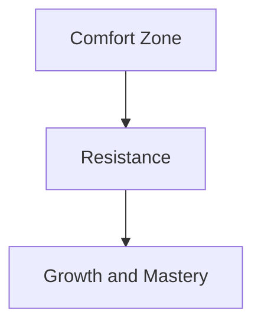

import { Callout, Steps, Step } from "nextra-theme-docs";

# Strategies for Combating Resistance

Now that we've [defined what Resistance is](/overcoming-resistance/defining-resistance), it's time to explore effective strategies for overcoming it. Resistance can be a formidable opponent, but with the right mindset and tactics, you can break through its barriers and unlock your creative potential.

## Recognize Resistance in Its Many Forms

Resistance is a shape-shifter, taking on various guises to derail your progress. Some common manifestations include:

- Procrastination
- Self-doubt
- Perfectionism
- Fear of failure or success
- Distractions and escapism

By learning to spot Resistance's disguises, you can confront it head-on and prevent it from sabotaging your efforts.

## Develop a Professional Mindset

One of the most powerful ways to combat Resistance is by [cultivating professionalism](/professionalism-consistency/professional-mindset). This means:

- Showing up consistently, even when you don't feel inspired
- Treating your creative pursuits as a serious endeavor, not just a hobby
- Maintaining discipline and focus in the face of obstacles
- Continuously honing your craft and skills

<Callout>
As Steven Pressfield writes, "The professional has learned that success, like happiness, comes as a by-product of work."
</Callout>

## Break Projects into Manageable Steps

Resistance thrives on overwhelm and the feeling that a task is too daunting to tackle. To counteract this, break your projects into smaller, more manageable steps:

<Steps>

### Step 1
Define your ultimate goal and work backwards, identifying the milestones you need to reach along the way.

### Step 2
Create a timeline and set deadlines for each milestone to maintain accountability and momentum.

### Step 3
Focus on completing one step at a time, celebrating your progress and accomplishments along the way.

</Steps>

By chunking your work into bite-sized pieces, you'll feel more in control and less susceptible to Resistance's intimidation tactics.

## Embrace the Struggle

Resistance often intensifies when we're on the verge of a breakthrough or taking on a challenge that stretches us beyond our comfort zone. Instead of interpreting this discomfort as a sign to give up, reframe it as an indication that you're on the right track.

Embrace the struggle as an integral part of the creative process, knowing that pushing through Resistance is what separates professionals from amateurs.

## Seek Support and Accountability

While the creative journey is ultimately a solitary one, having a support system can be invaluable in overcoming Resistance. Consider:

- Joining a writers' group, mastermind, or professional association in your field
- Finding an accountability partner to share goals and progress with
- Working with a mentor or coach who can offer guidance and encouragement

<Callout>
Remember, even the most successful creators battle Resistance. You're not alone in this fight.
</Callout>

## Prioritize Self-Care and Balance

Resistance often gains a foothold when we're run down, burnt out, or neglecting our physical and emotional well-being. To maintain the energy and resilience needed to combat Resistance:

- Prioritize adequate sleep, nutrition, and exercise
- Set boundaries around work and create space for rest and rejuvenation
- Engage in activities that bring you joy and fulfillment outside of your creative pursuits

By taking care of yourself holistically, you'll be better equipped to face Resistance with clarity and strength.

## Stay Connected to Your "Why"

When the going gets tough, it's easy to lose sight of the bigger picture and the reasons behind your creative endeavors. To stay motivated and committed:

- Regularly revisit your [authentic voice and calling](/authentic-voice/embracing-calling)
- Visualize the impact and meaning your work will have for yourself and others
- Surround yourself with inspirational quotes, images, or stories that remind you of your purpose

By staying rooted in your "why," you'll find the courage and determination to keep moving forward, even in the face of Resistance.

<Callout>
As Pressfield asserts, "The more important a call or action is to our soul's evolution, the more Resistance we will feel toward pursuing it."
</Callout>

Implementing these strategies consistently and compassionately can help you build the resilience and tenacity needed to overcome Resistance and bring your creative visions to life. Remember, every small victory against Resistance is a step towards mastery and the realization of your fullest potential.