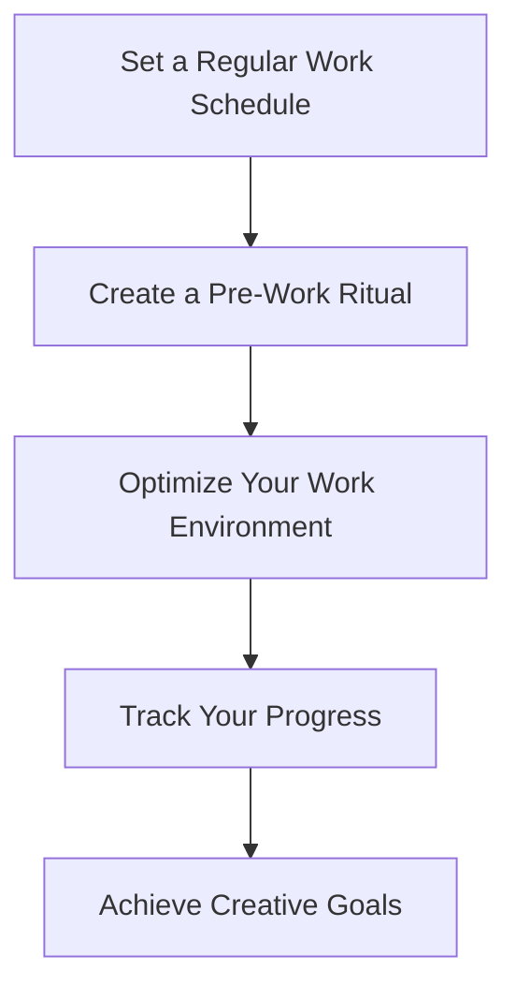

import { Callout, Steps, Step } from "nextra-theme-docs";

# Establishing a Consistent Work Ethic

Creating a consistent work ethic is essential for overcoming [Resistance](/overcoming-resistance) and achieving your creative goals. By establishing a routine and optimizing your work environment, you can build the discipline and momentum needed to produce high-quality work on a regular basis.

## Develop a Daily Routine

One of the most effective ways to cultivate a consistent work ethic is to establish a daily routine. This helps you develop the habit of showing up and doing the work, even when you don't feel motivated or inspired.

<Steps>

### Step 1: Set a Regular Work Schedule

- Choose a specific time each day to dedicate to your creative work.
- Be realistic about how much time you can commit, but aim for at least an hour per day.
- Treat this time as sacred and non-negotiable, just like any other important appointment.

### Step 2: Create a Pre-Work Ritual

- Develop a series of actions that signal to your mind that it's time to work.
- This could include things like brewing a cup of coffee, lighting a candle, or doing a few stretches.
- Consistently performing this ritual will help you transition into a focused and productive state.

</Steps>

<Callout type="warning">
Remember, the key to success is consistency. It's better to work for a shorter period every day than to have sporadic, marathon sessions followed by long periods of inactivity.
</Callout>

## Optimize Your Work Environment

Your surroundings can have a significant impact on your ability to focus and produce your best work. Here are some tips for creating an environment that supports your creative efforts:

- **Designate a specific workspace:** Choose a location that is solely dedicated to your creative pursuits. This could be a separate room, a corner of your living space, or even a particular table at a coffee shop.

- **Minimize distractions:** Remove any potential distractions from your workspace, such as clutter, social media notifications, or television. If necessary, use tools like website blockers or noise-cancelling headphones to help you stay focused.

- **Surround yourself with inspiration:** Fill your workspace with items that inspire and motivate you, such as artwork, quotes, or images related to your creative goals. This can help you stay connected to your purpose and maintain a positive mindset.

By intentionally designing your work environment, you create a space that supports your efforts to establish a consistent work ethic and [overcome Resistance](/overcoming-resistance).

## Track Your Progress

Monitoring your progress is an essential part of maintaining a consistent work ethic. By regularly assessing your accomplishments, you can stay motivated and identify areas for improvement.

Consider using a tool like a habit tracker or a project management app to:

- Set specific, measurable goals for your creative work
- Record your daily progress
- Celebrate milestones and achievements
- Analyze patterns and adjust your routine as needed

Remember, the goal is not perfection, but rather consistent effort and growth. By tracking your progress, you can stay accountable and motivated as you work towards your creative goals.

By following these steps and committing to a consistent work ethic, you can overcome Resistance and bring your creative visions to life. As Steven Pressfield writes in *The War of Art*:

> $\text{The most important thing about art is to work. Nothing else matters except sitting down every day and trying.}$

So, embrace the [professional mindset](/professionalism-consistency/professional-mindset), trust the [role of the Muse](/higher-inspiration/role-of-muse), and keep showing up to do the work. Your dedication and discipline will pay off in the form of meaningful creative accomplishments.